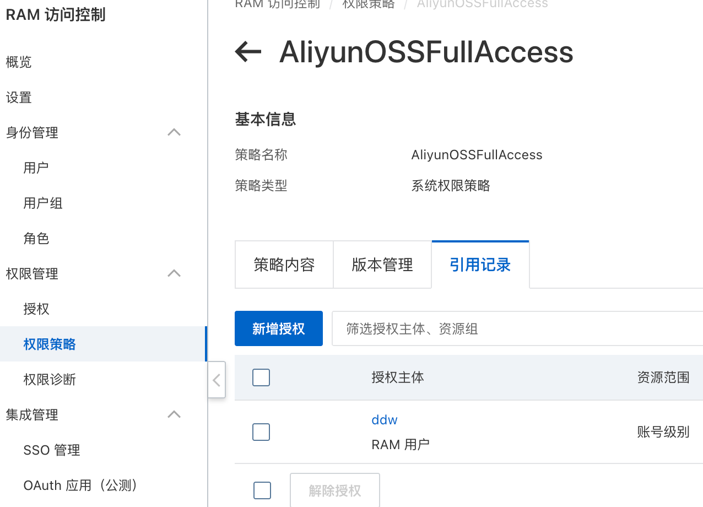
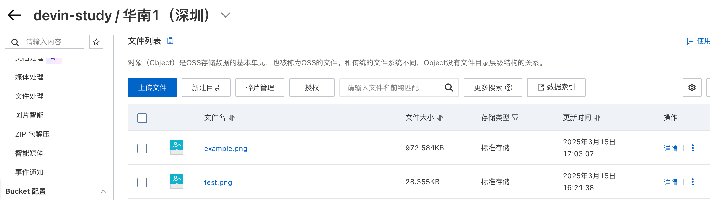

# Oss-devin
Upload static assets to the OSS server.

## 实现步骤
1. 阿里云账户注册登录

2. 创建 oss 服务实例

3. 服务器上进行上传图片、自定义域名
    - 购买域名（如 mywebsite.com）。
    - 解析 CNAME 到 OSS：
        • 在域名管理后台 添加 CNAME 记录，将 oss.mywebsite.com 解析到 OSS 提供的域名（如 my-bucket.oss-cn-shanghai.aliyuncs.com）。

4. 新建 ram 账户：获取 accessKeyId & accessKeySecret 用于开发

5. 查看上传文件等基本使用教程 api 开发：
    - 开发运行中发现没有权限，发现需要给 ram 账户设置 oss 权限
    - ram账户设置oss权限
    

6. deploy 部署

7. 成功上传到 oss 服务器
    - 图中的 example.png 就是通过本地开发上传上去的
    

## OSS 适用场景
	•	网站静态资源存储（CSS/JS/HTML/图片/视频）
	•	文件上传存储（用户上传头像、附件）
	•	CDN 加速（搭配 OSS 作为源站）
	•	日志 & 备份存储（定期存储服务器日志、数据库备份）
	•	大文件存储 & 分发（软件包、音视频等）